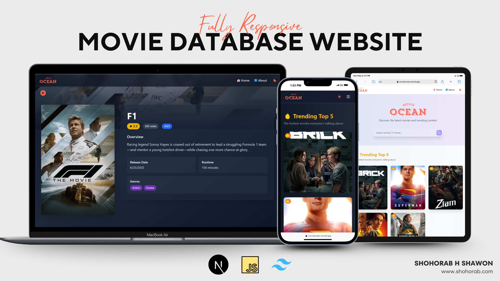

# MovieDB - Next.js Project

Welcome to **MovieDB**, a web application built with [Next.js](https://nextjs.org/). This project was bootstrapped using [`create-next-app`](https://github.com/vercel/next.js/tree/canary/packages/create-next-app).

## 🚀 Getting Started

To run the development server:

```bash
npm run dev
# or
yarn dev
# or
pnpm dev
# or
bun dev
```

Visit [http://localhost:3000](http://localhost:3000) in your browser to view the app.

Start editing by modifying `app/page.js`. Changes are reflected instantly.

## 🖋 Features

- Built with Next.js 13+ App Router
- Uses [`next/font`](https://nextjs.org/docs/basic-features/font-optimization) for optimized font loading
- Ready for deployment on Vercel

## 📚 Learn More

- [Next.js Documentation](https://nextjs.org/docs)
- [Next.js Learn](https://nextjs.org/learn)
- [Next.js GitHub](https://github.com/vercel/next.js/)

## 🚢 Deployment

Deploy your app instantly with [Vercel](https://vercel.com/new?utm_medium=default-template&filter=next.js&utm_source=create-next-app&utm_campaign=create-next-app-readme).

For more deployment options, see the [Next.js deployment docs](https://nextjs.org/docs/deployment).

---

Feel free to contribute or provide feedback!
